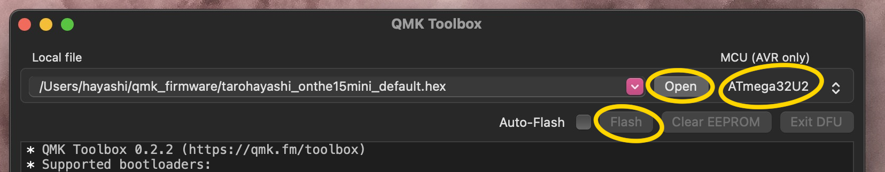
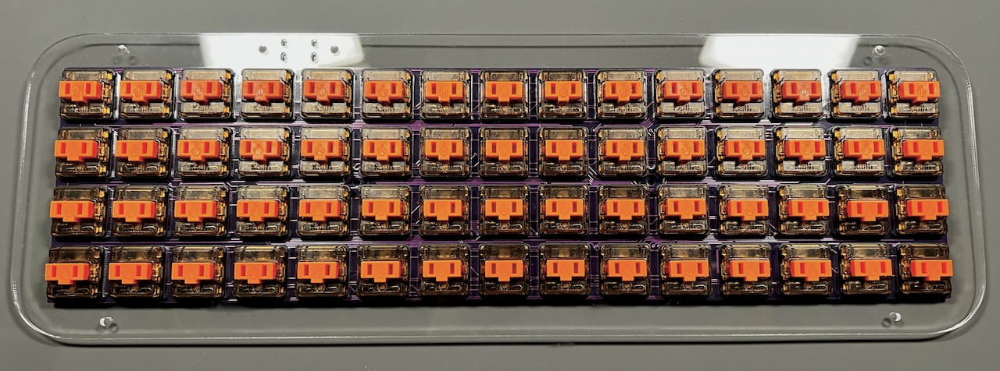

# On the 15 mini ビルドガイド
- [キット内容](#キット内容)
- [組み立て](#組み立て)
- [カスタマイズ](#カスタマイズ)
- [その他](#その他)

## キット内容
  
  
||部品名|数| |
|-|-|-|-|
|1|メインボード|1||
|2|Type-C レセプタクル|1||
|3|リセットスイッチ|1||
|4|Atmega32u2|1||
|5|5.1kΩ|2|R1、R2|
|6|22Ω|2|R3、R4|
|7|10kΩ|2|R5、R6|
|8|水晶振動子|1|16MHz|
|9|22pF|2|C1、C2|
|10|1uF|1|C3|
|11|0.1uF|3|C4、C5、C6|
|12|4.7uF|1|C7|
|13|ダイオード|60||
|14|スペーサー（細）（短）|2|3mm|
|15|スペーサー（太）（長）|6|4mm|
|16|ナベねじ（短）|2|2.5mm|
|17|超低頭ねじ（中）|8|3.5mm|
|18|バインドネジ（長）|6|4mm|
|19|ゴム足|6||
|20|トッププレート|1||
|21|スイッチプレート|1||
|22|ミドルプレート|2||
|23|ボトムプレート|1||

### キット以外に必要なもの
|部品名|数||
|-|-|-|
|Kailh LowProfile Switch|60|[TALP KEYBOARD](https://talpkeyboard.net/?category_id=638b0e4618324e3c19f56b88)、[遊舎工房](https://shop.yushakobo.jp/collections/all-switches/Kailh-Choc-V1スイッチ)|
|CFXプロファイル1Uキーキャップ|60|[TALP KEYBOARD](https://talpkeyboard.net/?category_id=638d75c18da73b0695940f48)、[遊舎工房](https://shop.yushakobo.jp/search?type=product&options%5Bprefix%5D=last&options%5Bunavailable_products%5D=last&q=CFX)|
|Type-C USB ケーブル|1|[遊舎工房](https://shop.yushakobo.jp/products/usb_type_a_to_c_cable?_pos=3&_sid=d2e0de26b&_ss=r)、[秋月電子通商](https://akizukidenshi.com/catalog/g/gC-13563/)、100円均一など|
 
### オプション
|部品名|数||
|-|-|-|
|LED（SK6812MINI-E）|60|[遊舎工房](https://shop.yushakobo.jp/products/sk6812mini-e-10)、[秋月電子通商](https://akizukidenshi.com/catalog/g/gI-15478/)、[BOOTHオプション](https://tarohayashi.booth.pm/items/4500749)|

### 必要な工具
|工具名||
|-|-|
|はんだごて|D型など細かい作業がしやすいコテ先がおすすめです|
|はんだ||
|フラックス|MCUやコネクタ、LEDのはんだ付けにおすすめです|
|フラックスリムーバー||
|ピンセット||
|精密ドライバー||

## 組み立て
### MCU周辺のはんだ付け
小袋の番号に合わせて基板にはんだ付けしていきます。　　
 
ATmega32u2をはんだ付けします。チップの○と基板上の○の方向を合わせてください。　　
 
黄丸の部分には今ははんだ付けせず、スイッチの穴を埋めないようにします。  
  
抵抗やコンデンサー、水晶振動子をはんだ付けします。小袋の中から出すと見分けがつかないので、1種類ずつはんだ付けしてください。　　
 
水晶振動子には縦横の向きがありますが、抵抗、コンデンサーには方向はありません。  　
  
Type-Cレセプタクルとリセットスイッチをはんだ付けします。  
 
これでPro Microと同じ機能が実装できました。テスト用ファームウェアをダウンロードして書き込めることを確認しましょう。　　
- [tarohayashi_onthe15mini_default.hex](https://github.com/Taro-Hayashi/On-the-15-mini/releases/download/0.19.12dev/tarohayashi_onthe15mini_default.hex)

ファームウェアの書き込みにはQMK Toolboxを使います。　　
- QMK Toolbox https://github.com/qmk/qmk_toolbox/releases

QMK toolboxでダウンロードしたファイルを開いたら、MCUの欄をATmega32U2に変更してリセットスイッチを押し、出てきたFlashのボタンを押します。  
 
Flash completeの表示が出たら書き込み成功です。うまくいかない場合は各部のはんだ付けを見直してください。　　
 
動作確認ができたらお好みでType-Cレセプタクルをエポシキ接着剤で補強すると安心感があります。　　
 
### キーボード部品のはんだ付けと組み立て
LEDは最初に取り付けます。はんだ付けする時はケーブルは外してください。  
足の切り欠きと基板の「の方向を合わせてください。  
 
全て取り付けたらUSBケーブルを接続して発光を確認しましょう。  
  
ダイオードをはんだ付けします。  
  
全て取り付けたらピンセットでキースイッチのホールを導通させて1〜60が入力されるか確かめてください。  
  
付属品のはんだ付けをご依頼の場合はここまでの作業を代行いたします。  
  
破損防止のためケースは組み立てられて発送されています。ネジやスペーサーは無くさないように保存してください。  
  
スイッチプレートの保護フィルムを剥がしたら、キースイッチでPCBと挟み込みはんだ付けします。  
  
4隅からはんだ付けすると位置がずれにくいです。全て取り付けたらもういちど動作を確認しましょう。   
  
PCBにスペーサー（細）（短）をナベねじ（短）で取り付けます。  
  

トッププレートにスペーサー（太）（長）をバインドネジ（長）で取り付けます。  　
  
ボトムプレートでミドルプレートを2枚挟み込み、超低頭ねじ（中）で止め、ゴム足を付けます。  
  
キーキャップを差し込んだら完成です。　　
  
  
ファームウェアをこちらに書き換えてください。  
左上のキー（画像のESCアイコン）を押しながらUSBケーブルを接続するとリセットボタンを押した時と同じ状態になるため、裏返す必要がありません。  
- [tarohayashi_onthe15mini_via.hex](https://github.com/Taro-Hayashi/On-the-15-mini/releases/download/0.19.12dev/tarohayashi_onthe15mini_via.hex)
  
書き換えに成功すると完成画像と同じ配列のキーボードとして使えるようになっています。  
LEDは左上のキーを押しながら、その下のキーを押すと消灯で横のキーで光り方を変更できるように設定されています。  

## カスタマイズ
キー設定の変更はVIAのwebサイトかアプリケーションを使用します。　　
- [Web版VIA（Google ChromeかMicrosoft Edgeでアクセスしてください）](https://usevia.app/#/design)
- [アプリ版VIA](https://github.com/the-via/releases/releases)
  
こちらのJSONファイルをダウンロードしてください。　　
- [onthe15mini.json](https://github.com/Taro-Hayashi/On-the-15-mini/releases/download/0.19.12dev/onthe15mini.json)
  
DESIGNタブのLoadでダウンロードしたJSONファイルを読み込ませるとキーの変更が出来るようになります。  
（アプリ版ではまずSETTEINGSタブでShow Design tabをオンにしてください。） 　　
   
CONFIGUREタブのAuthorize device+からOn the 15 miniを追加するとキーを置き換えることができるようになります。
   
お好きな配列に変更してお使いください。

## その他

ファームウェアのフォルダ  
- https://github.com/Taro-Hayashi/On-the-15-mini/tree/main/qmk_firmware/keyboards/tarohayashi/onthe15mini

堕落猫さんのmatrix.cを流用、改変して使用いたしました。
- URL https://github.com/darakuneko/keyboard
- ライセンス https://github.com/darakuneko/keyboard/blob/main/LICENSE
  
販売サイト
- BOOTH: https://tarohayashi.booth.pm/items/4500749
